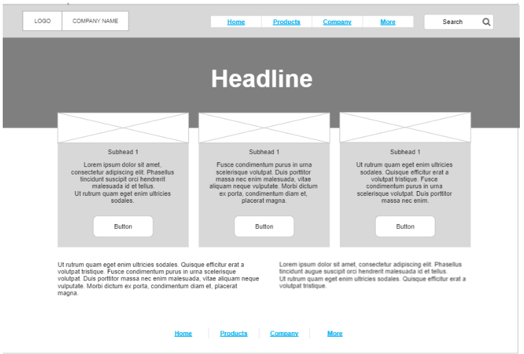

# wireframe2website

### We convert this four images to HTML codes by using Visual studio code.

+ Here the Home page image 
+ Here the Products page image 
+ Here the Company image 
+ Here the More image 

### I used the following tools:
1- VS code.
2- HTML "Hyper Text Markup Language" to write the codes.
3- git bash.
4- github. 